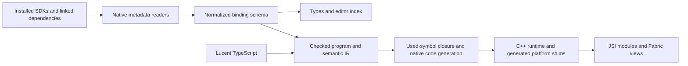

# Lucent: a complete native development platform

Design specification, written 2026-09-24 as a proposal and published
2026-10-01. It is the design behind [ROADMAP.md](../../ROADMAP.md), which
holds the work queue, each task's status, the release gates and the
decisions taken since. The interfaces this design produced are in
[contracts.md](contracts.md); the view design as built is in
[views.md](views.md).

Sections 1–10 establish the strategy and release gates. Sections 11–18
provide implementation contracts, examples, affected files, and an ordered
delivery backlog. New API names and paths in those sections were proposals
when written; many have since been implemented, some differently.

## What changed since this was written

The text below is kept as written, with short notes where a later
decision replaced it. The decisions, with dates and reasons, are in
[ROADMAP.md's decisions log](../../ROADMAP.md#decisions-log).

- **SwiftUI and Compose are written in Lucent** (decided 2026-09-26). This
  replaces section 16.8's statement that Lucent does not translate SwiftUI
  or Compose bodies. A component's body is the platform toolkit's own JSX
  (`lucent:swiftui`, `lucent:compose`, both generated from the installed
  SDKs), emitted as Swift `View` and Kotlin `@Composable` source; its logic
  compiles to C++. There is no cross-platform view vocabulary.
- **No wrappers.** `native()` (sections 4 and 16.1) was removed: a setup
  constructs its view directly and returns it. The `swiftUI(() => …)` and
  `compose(() => {…})` call forms that came first were replaced by JSX with
  no wrapper (decided 2026-09-29).
- **One-file components** (decided 2026-09-30): a `.lucent.tsx` component
  holds its logic once and each platform's body in a `PLATFORM` branch;
  split `*.ios.lucent.tsx` / `*.android.lucent.tsx` files remain supported.
- **Kotlin metadata reader** (section 12.3): the comparison is done; the
  TypeScript decoder ships and the official JVM library is a test oracle.
- **Named awaitables** (sections 3 and 12.4): removed. `await` on a native
  object is `LUCENT1010`; `fromCallback` and `subscribe` in `lucent:core`
  adapt listeners, and native `async`/`suspend` comes from metadata.
- **Native 64-bit integers** (section 6, M1): every one (`long`,
  `int64`/`uint64`, `NSInteger`/`NSUInteger`, Swift `Int`/`Int64`/`UInt64`)
  crosses as `bigint` (decided 2026-09-25).
- **Status of section 2.** The audit describes the repository on
  2026-09-24. ROADMAP.md's status section replaces it.

Implementation navigation:

- [File map and API conventions](#11-implementation-map-and-api-conventions)
- [Discovery, schemas, and platform shims](#12-discovery-schemas-and-platform-shims)
- [Semantic IR and compiler passes](#13-semantic-ir-and-compiler-passes)
- [Execution, ownership, and cancellation](#14-execution-ownership-and-cancellation)
- [JSI objects, buffers, and native extensions](#15-jsi-objects-buffers-and-native-extensions)
- [Views from source to Fabric](#16-views-from-source-to-fabric)
- [Lifecycle, packages, and developer workflow](#17-lifecycle-packages-and-developer-workflow)
- [Implementation slices and concrete tests](#18-implementation-slices-and-concrete-tests)

## 1. The product we should build

**Write native behavior in TypeScript, import it from React, and let Lucent
handle bindings, compilation, integration, and diagnostics.**

The ambition is capability parity with Nitro and Expo Modules, excellent
performance, and a substantially smaller authoring model. The initial
production target is React Native's New Architecture on iOS and Android,
in both bare and Expo apps. Other React Native platforms need their own
integration and acceptance gates; success on these two is not universal
platform support.

Four promises should shape the work:

1. **One implementation is the spec.** Export ordinary functions, classes,
   and components. Derive the React-facing types and native bindings from
   them. Keep the checked TypeScript subset and single-file platform branches.
2. **Discover the installed native world.** No maintained catalog of SDKs,
   APIs, supported views, or per-library bindings. Installing or upgrading a
   native dependency makes its public declarations discoverable without a
   Lucent release.
3. **Make costs predictable.** Explain copies, thread transitions, ownership,
   and rebuilds. Fast call overhead, fast computation, responsive views, and
   fast development feedback are separate requirements.
4. **Finish real integrations.** Lifecycle, permissions, configuration,
   cancellation, packaging, debugging, and upgrades are part of a native
   module. A callable SDK method is only one part of the job.

"Anything Nitro or Expo Modules can build" needs two supported paths:
automatic TypeScript bindings for representable native declarations, and a
general typed extension path for capabilities that metadata cannot express.
An extension remains part of the same Lucent package and build. Ordinary
modules should not require handwritten Swift, Kotlin, or C++; generated
shims are an implementation detail. Opaque native libraries and specialized
native behavior may require a small native adapter. An absolute promise to
translate every native construct into TypeScript automatically would be
misleading.

The first useful release should make building native modules and wrapping
native views excellent. A large cross-platform UI toolkit should follow
evidence from those uses.

## 2. What exists, and what the plans currently miss

This audit reads the repository and its status documents. Their recorded
test results are historical evidence; no runtime or device suites were
rerun while writing this plan. The checkout also contains ongoing Swift
work, so these are planning boundaries rather than a release certification.

| Area       | Current foundation                                                                                                            | Work required for the ambition                                                                        |
| ---------- | ----------------------------------------------------------------------------------------------------------------------------- | ----------------------------------------------------------------------------------------------------- |
| Compiler   | TypeScript checker, representation types, C++ lowering, integer inference, structured code-generation ASTs                    | A semantic typed IR, effect/ownership analysis, measured optimization passes                          |
| JSI        | One C++ TurboModule, generated converters, `NativeState` class instances, identity caching, JS-thread-owned `Host` references | Explicit high-throughput buffers, lifetime accounting, contention and teardown tests                  |
| Execution  | Async exports run on one Lucent thread; all Lucent execution shares a recursive lock                                          | UI isolation and genuinely isolated compute; async alone does not prevent lock contention             |
| SDKs       | Extracted ObjC/Java APIs, callbacks, generics, platform guards, linked pods/Gradle dependencies; substantial Swift shim work  | Finish Swift acceptance; Kotlin metadata/shims; iOS subclassing; lifecycle/context; native extensions |
| Tooling    | One package, incremental builds, editor diagnostics, `dev`, `doctor`, SDK search/show/coverage, benchmarks                    | Reliable end-to-end rebuild orchestration, SDK diff/locking, profiling, richer editor fixes           |
| Packaging  | Source packages, transitive discovery, dependency/config merging                                                              | SPM and native artifacts, additional build targets, repeatable upgrades and compatibility testing     |
| Views      | A detailed proposal                                                                                                           | Fabric proof on both platforms; ownership, sizing, updates, React composition, accessibility          |
| Validation | Differential tests, glue compilation, sanitizers, host budgets, simulator/emulator examples                                   | Physical devices, sustained workloads, independent library authors, production soak tests             |

The typed IR phase was not started at the time of this audit.
`packages/codegen` supplies output syntax trees; it does not provide the
semantic IR assumed by the views attachment. Also, full-SDK Part 2 still has
unchecked build and port acceptance, Parts 3–4 remain open, and the public
roadmap lags some completed Part 1 work.

Two existing choices deserve priority:

- [The scheduler](../../packages/runtime/cpp/lucent/scheduler.h) and
  [main-thread dispatch](../../packages/runtime/cpp/lucent/native.h) share
  the same Lucent lock. A long computation can delay a main-thread callback
  or view update even though the computation is off the JS thread.
- [Byte conversion](../../packages/runtime/cpp/lucent/jsi/convert.cpp)
  copies in both directions. This is a useful safe default, but an
  inadequate sole transport for camera frames, audio, images, or large data.

## 3. No curated SDK or API catalog

This is an architectural invariant, not a later cleanup task.



**Discover at build time, execute compiled code at runtime.** Dynamic
discovery does not require runtime reflection on every call or a JavaScript
engine inside Lucent's native implementation.

The discovery and binding contract:

- Discover declarations from the actual build graph: SDK modules, headers,
  Clang declarations, Swift symbol graphs/module interfaces, JVM classfiles,
  Kotlin metadata, and dependency build outputs. Preserve target, version,
  availability, nullability, generics, ownership, and thread annotations.
- Generate declarations and glue by language/ABI/type rules. A discovered
  symbol is callable when its shape is supported, irrespective of its name
  or framework. Emit native implementations only for the used dependency
  closure; index more declarations lazily for editor search.
- Separate **facts in metadata**, **safe structural conventions**, and
  **behavior requiring an explicit implementation**. A method named
  `addListener` does not prove cancellation semantics. A `ViewGroup` does
  not prove that arbitrary children can be inserted through `addView`.
- Expose the raw, typed native member whenever representable. Ergonomic
  sugar must never be the only way to reach it. Ambiguous sugar produces a
  diagnostic or stays unavailable; it must not guess behavior silently.
- Retain a general mechanism for project/package-provided metadata and
  typed adapters, validated against the dependency being built. It must be
  optional for ordinary extraction, declarative where possible, and local
  to its owner. Lucent must not ship an expanding per-SDK override database.
- Distinguish the small platform implementation surface—JSI, Fabric, UIKit
  view identity, Android view identity, JNI/ARC, app lifecycle—from an API
  catalog. These establish the integration; they must not become a growing
  switch over named SDK classes and methods.

This changes full-SDK Part 4. Moving hardcoded awaitables into Lucent-owned
API-notes files would relocate the catalog, not remove it.
The awaitable emitter of the time (`emit/awaitables.ts`, since removed)
had named Task/Future/CompletionStage handling. Replace library-specific
compiler dispatch with general callback/promise composition, native async
metadata where available, and explicitly imported adapters where needed.
Retire old sugar with a diagnostic and migration path; do not silently break
existing sources. Package authors can implement an adapter in Lucent using
the extracted API, without asking Lucent to recognize their class name.

**Acceptance:** after the compiler is built, create an independently named
fixture SDK with new classes, views, callbacks, generic types, and supported
Swift/Kotlin declarations. Bind and run it without changing Lucent. Repeat
with a new SDK version and a transitive dependency. Randomize names to catch
hidden name matching. Fixture inventories and benchmark examples are tests,
never binding allowlists.

## 4. A small authoring model

Keep the public model to a few concepts:

| The author wants               | The author writes                                                       |
| ------------------------------ | ----------------------------------------------------------------------- |
| A native function              | An exported function in `.lucent.ts`                                    |
| A long-lived native resource   | An exported class with explicit disposal when needed                    |
| Async work                     | `async`/`await`, with cancellation tied to an owner or `AbortSignal`    |
| A platform API                 | An import from the discovered SDK and a platform branch                 |
| A React-renderable native view | A component in `.lucent.tsx` (originally via `native()`, since removed) |
| Local view state               | `signal`, `effect`, and scoped cleanup                                  |
| CPU parallelism                | One explicit isolated-compute facility; not shared mutable closures     |

Avoid separate author-maintained module specs, registration names, event
schemas, view manifests, and duplicated TS interfaces. Derive these from
the same checked program. Validate shared exports across platforms.

Views use setup-once semantics. React owns the outer component; Lucent owns
the mounted native subtree. Props are reactive inputs; effects update the
subtree. This deserves a short explicit tutorial because JSX does not imply
React hooks or React re-render semantics. Solid's
[fine-grained reactivity](https://docs.solidjs.com/advanced-concepts/fine-grained-reactivity)
is a useful reference for dependency tracking and cleanup. The following
scheduling and ownership choices are proposals for Lucent, not claims that
Solid's implementation can be copied unchanged.

Recommended decisions for the attachment's open questions:

- Keep components in `.lucent.tsx`, including wrappers that return `native()`
  without JSX. Keep `.lucent.ts` for module logic initially.
- Keep `lucent:ui` as one public entry point for view helpers and primitives.
- React-facing hosts accept React Native `style`. Inside the Lucent subtree,
  reserve `layout` for layout and preserve native property names separately.
- Layout ownership must be explicit. Adding a width must not accidentally
  change a native container into a Yoga container.
- Start with explicitly constrained hosts. Treat intrinsic sizing as a
  separate capability whose behavior is measured, not silently approximate
  every native view's size.
- Report props destructured into stale setup snapshots, including aliases
  and helper calls where analysis can establish the mistake. Do not warn on
  every signal read outside an effect: reading a signal in an event handler
  is useful and intentional.

## 5. Architecture to settle before broadening views

### Semantic IR and optimizations

Retain TypeScript as the checker and C++ as the initial native backend.
Introduce a semantic IR between the checker and code-generation ASTs:

1. Explicit values, control flow, source locations, representation changes,
   evaluation order, exceptions, and suspension points.
2. Call effects: allocation, mutation, throwing, callback/reentrancy,
   thread/owner affinity, and potential blocking. Unknown effects remain
   conservative, with an explicit native extension contract where needed.
3. Ownership, escape, and alias facts sufficient to validate native
   lifetimes and isolated tasks. TypeScript `readonly` alone is not proof
   of deep immutability or transferability.
4. Small verified passes: constant/dead-branch removal, specialization,
   devirtualization, redundant conversion elimination, escape-based
   allocation reduction, and retain/release reduction. Prioritize using
   profiles; let Clang perform machine-level optimization.

Migrate one lowering family at a time behind existing differential tests.
Keep the existing backend while comparing both paths, then remove it once
the full supported subset passes. Do not make a complete optimizing compiler
rewrite a prerequisite for the first Fabric experiment.

Static Hermes offers concrete examples of
[typed/effect-aware IR](https://github.com/facebook/hermes/blob/static_h/include/hermes/IR/IR.h)
and [verified lowering to C](https://github.com/facebook/hermes/blob/static_h/lib/BCGen/SH/SH.cpp).
[Porffor currently describes an IR-to-C AOT pipeline](https://github.com/CanadaHonk/porffor),
supporting the decision to keep a portable native compiler backend.
Borrow separation of concerns and measurable lowering techniques. Neither
project's runtime, language coverage, nor benchmark results establish what
Lucent can achieve.

Preserve JavaScript numbers, UTF-16 behavior, observable side effects,
exceptions, and reference identity. Keep `-ffp-contract=off`. Range-based
integer optimization, vectorization, and allocation removal require proofs
that preserve those semantics. Do not enable fast-math as a shortcut.

### Ownership and execution

Keep existing module execution semantics until a separately tested migration
is ready. New view execution must not wait behind arbitrary module work.
The recommended architecture is **state owned by an execution context**:

- A view and its signals belong to the main/UI context. Only that context
  mutates them. Props arrive as immutable update batches; events leave as
  copied values or safe resource handles.
- Existing module state stays serialized. Calls from a view into mutable
  module state are asynchronous messages. Shared mutable globals cannot
  silently connect the two contexts; diagnose them and provide a migration.
- Pure helpers can execute locally. Heavy work runs through an isolated
  compute task with checked captures, copied/owned inputs, and cancellation.
  Workers do not hold the module or UI lock while computing.
- Promises express completion, not parallelism. Define which context resumes
  each continuation, how cancellation propagates, and what happens when its
  owner is disposed. CPU cancellation requires explicit safe checkpoints;
  an `AbortSignal` cannot interrupt arbitrary native instructions.
- No synchronous UI-to-JS, UI-to-worker, or JS-to-UI wait cycles. Native
  callbacks that require an immediate return execute in a valid local
  context or are rejected with an actionable diagnostic. Never pretend an
  asynchronous JS callback can supply a synchronous platform answer.
- Keep JSI values exclusively on their runtime's JS thread through `Host`
  identifiers. Invalidate pending work on runtime reload/destruction, and
  ensure multiple runtimes cannot accidentally share JS handles.

Introduce one internal lifetime scope for a module instance, view mount,
subscription, and owned task. Dispose listeners, timers, delegate links,
effects, and pending work deterministically. Add weak native/Lucent
references and debug ownership graphs. Plain reference-count cycles remain
an explicit language limitation until a separately measured collector is
justified; UI internals must not depend on users manually breaking them.
Release thread-affine native resources on their required thread, including
when their last reference disappears during cancellation or JS GC.

### Boundary performance and native extensions

Lucent already has the `NativeState` and prototype foundation highlighted
in [Nitro's architecture](https://nitro.margelo.com/docs/getting-started/what-is-nitro).
Build on it: generated direct calls, cached conversion metadata, stable
identity, native memory accounting where the supported JSI version permits,
and explicit resource disposal. Validate values at untrusted JS/native
boundaries; static TypeScript types do not validate JavaScript callers.

Preserve current copy semantics for ordinary arrays/objects/bytes. Add an
explicit owned-buffer/resource path for binary workloads. Distinguish
synchronous borrowed access, immutable snapshots, and exclusive native
ownership; define mutation and detachment behavior before exposing sharing.
JS-owned bytes must not escape onto a worker just because a pointer exists.
[Nitro's buffer documentation](https://nitro.margelo.com/docs/types/array-buffers)
is a useful reference for lifetime and concurrent-access hazards.

Measure generated JNI listener classes against the existing reflection
proxy, including code size and build time. Prefer generated direct dispatch
for demonstrated hot paths; base the choice on interface shape/use, never
an SDK-name list. Compare Swift C-ABI shims with direct Swift/C++ interop
using identical calls before changing backends. Preserve the full-SDK
decision to box Swift values initially; document alias/mutation behavior.

Provide a typed native-extension contract for C/C++, Swift, and Kotlin
sources: input/output shapes, ownership, executor, errors, and cancellation.
Generate the same Lucent-facing bindings and package integration. C
headers and representable C++ declarations can be discovered automatically;
opaque templates or custom ownership can use a small adapter. Direct JSI
access, if exposed to extension authors, stays an explicit expert API.
Deadline-sensitive audio/render callbacks need a restricted execution path
or native extension, with no allocations or contended locks on that path.

## 6. Delivery milestones and acceptance gates

Milestones describe completion criteria, not calendar commitments. Track
one owner, dependencies, evidence, and remaining blockers for each. Run
tooling, documentation, and benchmarks throughout the milestones.

### M0 — Establish the contract and baseline

- Create a capability matrix and reproducible benchmark manifest with exact
  RN, Expo, Hermes, Nitro, compiler, SDK, device, and build versions.
- Reconcile public roadmap claims with the full-SDK status; record
  implemented, compiled, simulator-tested, and physical-device-tested
  separately. Fix generated declaration errors currently hidden by
  `skipLibCheck`, including the roughly 400 noted in the SDK status.
- Adopt the no-catalog tests and record the execution, ownership, buffer,
  and extension decisions above as small design records.
- Establish minimal semantic IR and execution-effect infrastructure; retain
  a working baseline before optimization.

**Gate:** a fresh checkout reproduces the current examples; generated SDK
types have an explicit checked baseline and a plan to reach zero errors;
every gap has a test category and owner. No new unsupported capability is
advertised as working.

### M1 — Finish automatic SDK binding and the extension path

- Complete full-SDK Part 2 acceptance: Swift build settings, fixture
  goldens, static/dynamic framework configurations, bare/Expo builds, and
  CryptoKit, StoreKit 2, and AVFoundation ports.
- Complete Part 3: choose the Kotlin reader by measured extraction speed,
  installation burden, and reliability; cover suspend, nullability,
  defaults, value/sealed classes, extensions, and top-level declarations.
  Treat Flow subscription as a behavioral abstraction, implemented through
  general adapters where metadata is insufficient.
- Add iOS subclass/override support, remaining protocol requirements needed
  by real ports, availability checks on both platforms, and exact integer
  handling for native 64-bit values. Do not silently narrow IDs through
  JavaScript `number`; use an explicit exact representation where needed.
- Extend the type/ABI rules for buffers and bounded pointer access,
  out/inout parameters, metatypes/selectors, and protocol compositions.
  Resolve associated-type or opaque generic requirements through checked
  specialization or the extension contract. Preserve native escape and
  lifetime restrictions; an unchecked pointer cast is not a binding strategy.
- Add SPM, local frameworks/XCFrameworks, AAR/JAR/native artifacts, and
  native source extensions to the dependency graph and packaging model.
- Replace central per-library exceptions as described in section 3. Make
  coverage distinguish discovered, representable, emitted/compiled, and
  exercised members; include reasons and declaration provenance.

**Gate:** unfamiliar fixture libraries work without compiler edits; the
Swift/Kotlin ports pass in both apps on both platforms; an npm-installed
library can include a small native extension without a second module
framework. No hardcoded library registry is required.

### M2 — Complete the native application environment

- Expose the active Android Activity/FragmentActivity with correct absence,
  recreation, and lifetime behavior, plus the iOS scene/presentation context.
- Support activity results, permission requests, app/scene lifecycle,
  intents/URLs, restoration, and event subscriptions through generated
  registration and typed callbacks. Include startup before JS exists and
  teardown after JS is gone.
- Extend package configuration to resources/assets, entitlements, usage
  strings, manifest components, background modes, and additional native
  targets. Merge deterministically and explain conflicts with provenance.
- Design headless/background entry points and services/extensions with an
  explicit runtime lifetime; do not make a process-global JS runtime an
  implicit dependency. Respect each platform's execution restrictions.

[Expo's module lifecycle APIs](https://docs.expo.dev/modules/module-api/),
[Android listeners](https://docs.expo.dev/modules/android-lifecycle-listeners/),
and [iOS subscribers](https://docs.expo.dev/modules/appdelegate-subscribers/)
show the integration surface to cover. Lucent should generate and compose
this plumbing from authored handlers, without recreating a large module DSL.

**Gate:** biometrics really presents on Android; picker/permission flows
survive recreation and cancellation; a deep link and background event work
across runtime reloads. Bare and Expo configuration can be regenerated
without manual edits to generated files. Additional targets have at least
one independently built fixture.

### M3 — Prove Fabric, execution isolation, and lifecycle

This spike may start once the necessary bindings are ready; it does not
wait for the entire SDK backlog or every optimization pass.

- Mount a label and an interactive control on both platforms, with props,
  events, and a command. Then exercise two different exported component
  types and two instances of each; one-label registration is insufficient.
- Define component names/handles, descriptors, props, events, state, command
  routing, recycling, and autolinking for the RN versions being supported.
- Test the proposed shared Android host implementation. Keep a shared
  runtime, but allow small generated per-component managers/delegates if
  Fabric registration requires them. "One fixed Java manager" is not a
  product constraint worth distorting the integration around.
- Implement UI-owned state and isolated compute. Exercise a busy JS thread
  and a separate long-running Lucent computation while UI updates continue.
- Settle constrained sizing and prototype intrinsic measurement using
  cached/state-driven layout. Never synchronously dispatch to the UI thread
  from an arbitrary Fabric measurement callback. Check initial layout shift,
  repeated layout convergence, constraints, and content changes.

React Native documents separate
[render, commit, layout, and mount phases](https://reactnative.dev/architecture/render-pipeline).
The Lucent subtree needs a clear integration at that boundary rather than
mutating Fabric's immutable shadow state from effects.

**Gate:** both apps on both platforms pass mount/update/unmount, recycling,
reload, late-callback, contention, and sizing tests. Record device traces and
the accepted sizing limitations in `docs/design/views.md` before expanding
the API. No global-lock stall can be hidden by a simple stopwatch demo.

### M4 — Ship useful native wrappers

- Ship `native`, `signal`, `effect`, scoped cleanup, and `expose` with typed
  React props/events/refs. Void commands enqueue to the UI owner; commands
  needing a result return a promise. Define behavior before mount and after
  unmount instead of relying on a stale native pointer.
- Define effect equality, dependency replacement, cleanup-before-rerun,
  batching, initial flush, nested scopes, and error reporting. Track only
  synchronous reads; asynchronous work uses a cancellable task/resource
  whose result is ignored after owner disposal or replacement.
- Start with a map, web view, camera preview, video player, and native input.
  Use narrow, stated parity scenarios before claiming full library parity.
- Implement React children/slots early enough for real composition, plus
  accessibility, focus, touch routing, gestures, clipping, keyboard/IME,
  safe-area/inset handling, RTL, and dynamic text-size behavior.

**Gate:** documented feature scenarios run beside their reference libraries;
controlled text does not break selection or composition; VoiceOver and
TalkBack can operate the controls; ref/event types match both platforms;
repeated mounting and backgrounding leaves no live owned resources.

This is the first views release worth putting in developers' hands. Call it
a preview with a precise support matrix; it need not wait for a UI kit.

### M5 — General JSX and a small standard UI library

- Derive construction, writable properties, and representable events from
  the binding schema. Provide explicit construction and adapter hooks for
  ambiguity. Keep `native()` as the universal wrapper path.
- Replace the attachment's `UIStackView`/container special cases with an
  explicit child/layout adapter contract. Default platform child operations
  apply only where their semantics are valid. Specialized containers may
  need authored insertion, removal, measurement, and invalidation behavior.
  A signature cannot reveal every custom container's contract.
- Add keyed conditional/list operations and a deterministic test backend.
  Define replacement vs mutation tracking for arrays/objects, stable key
  behavior, duplicate-key diagnostics, and nested component ownership.
- Implement Yoga layout with one owner per subtree and dependency-aware
  measure invalidation. Test font, image load, locale, density, and native
  content invalidation, not just prop changes.
- Implement a small `lucent:ui` library in Lucent over those facilities.
  The compiler supports reactivity/JSX and the generic platform boundary;
  primitives should not require private compiler cases.

**Gate:** the Badge, settings form, keyed list, and Stopwatch scenarios pass
on both platforms; changing one dependency updates only its affected
operations; unrelated subtrees remain untouched. New SDK view types require
no Lucent changes. Standard primitives pass accessibility and layout tests.

### M6 — Close the demanding capability gaps

- Add virtualized/recycled native lists, richer gesture/animation support,
  and view-controller containment. Do not conflate a short keyed list with
  a virtualized collection.
- Support SwiftUI/Compose through generated or authored native factories
  and typed state/events. They are separate declarative systems, not just
  additional subclasses of `UIView`/`View`.
- Prove large-buffer/media processing, C/C++ library integration, and
  dedicated callback executors. Keep camera/audio buffers native through
  multiple processing steps where possible; expose handles to JS.
- Define bounded queues and explicit backpressure for streams: lossless
  events, latest-value/coalesced updates, and frame-dropping policies have
  different semantics. Cancellation and disposal must release queued buffers.
- Complete the semantic IR migration and optimize the measured hotspots.
  Track code-size growth from specialization and generated listener classes.
- Cover remaining library-specific integration needs using general
  extension mechanisms, not core framework-name exceptions.

**Gate:** every capability class in section 7 has a passing implementation
or an explicitly documented platform limitation shared by the reference.
Lucent-specific missing mechanisms prevent a parity claim. A fallback
adapter counts as capability coverage, but is recorded separately from
automatic TS-only coverage.

### M7 — Make the workflow a reason to choose Lucent

Deliver these incrementally from M0; this milestone certifies the complete
experience rather than postponing tooling until the end.

- `init`/`new`: produce a working module or view with one package and a
  useful next step. Verify installation from an npm tarball in fresh apps.
- `dev`: watch transitive workspace packages; classify a change as JS-only,
  native recompile, or dependency relink; orchestrate the required steps
  without loops. Preserve an understandable build timeline and logs.
- Prevent stale code: compare generated proxy/native build identities and
  name the rebuild needed. Do not advertise native source edits as ordinary
  Fast Refresh or as deployable through a JS-only OTA update.
- `doctor`: diagnose Xcode/NDK/JDK/pods/Gradle/autolinking issues, stale SDK
  indexes, dependency conflicts, runtime mismatches, and unsupported targets.
- SDK tools: show declaration origin and generated mapping, diff the used
  symbols across SDK versions, and lock build identities for reproducibility.
  An editor-only cached index is allowed; release checks must fail when a
  target SDK is unavailable instead of quietly accepting untyped bindings.
- Editor: completions, go-to-native-declaration, API availability, quick
  fixes, thread/ownership diagnostics, and short explanations. Keep machine
  output and editor/CLI diagnostics driven by one schema.
- Debugging: extend existing `.lucent.ts` source locations to generated
  shims; combine native/JS logs, traces of copying/queueing, a view tree,
  effect updates, memory ownership, and inspectable generated code.
- Testing: JS reference execution for shared logic, a JS reference view
  backend with the same specified semantics, native component tests, and
  device tests. Ordinary React JSX execution is not a reference for Lucent's
  setup-once JSX semantics.

**Gate:** new developers independently build, debug, package, and install a
module and view without guidance from a maintainer. Track time to first
working result, unexplained failures, and generated files manually edited.
Target zero required edits to generated files.

### M8 — Production readiness and adoption

- Maintain a tested stable RN/Expo support window and a prerelease lane.
  Today's example manifests use RN 0.88 release candidates and an Expo 58
  preview; these alone cannot establish stable-version compatibility.
- Run packed-package tests, clean builds, upgrades, multiple Lucent
  libraries per app, R8, static/dynamic frameworks, and app-store-style
  Release builds. Source packages still produce one runtime per app.
- Publish reproducible device benchmarks and known gaps, plus guides for
  migrating Nitro/Expo modules while retaining their React-facing API.
- Pilot with at least three independent library authors and two real apps,
  covering a view, an SDK integration, and a compute/buffer workload.
- Establish semantic versioning, release/upgrade notes, deprecation paths,
  native crash reporting, and a compatibility incident process.

**Gate:** pilot apps pass sustained lifecycle/memory tests and production
usage; performance and compatibility gates pass; common issues can be
diagnosed from public documentation. "Default choice" is an adoption goal,
measured through successful independent use, not a compiler feature flag.

## 7. A capability matrix that proves parity

Maintain a living matrix of scenarios, reference versions, exact supported
features, automatic-vs-adapter path, tests, and evidence. These examples
exercise mechanisms; they never define which SDKs Lucent can bind.

| Capability class   | Representative acceptance workload                                                |
| ------------------ | --------------------------------------------------------------------------------- |
| Basic modules      | Haptics, secure storage, clipboard; sync/async calls, errors, cancellation        |
| Stateful objects   | Database/resource handles, identity across JS round trips, explicit close         |
| App integration    | Biometric prompt, picker result, permissions, deep links, lifecycle/recreation    |
| Modern SDK shapes  | CryptoKit, StoreKit 2, DataStore, Credential Manager; protocols, suspend, streams |
| Native views       | Map, web view, camera, video, native text input; props, events, commands          |
| Composition        | React children in a native container, navigation/containment, focus/accessibility |
| High-rate data     | Camera frames, audio blocks, sensor events, large database results; backpressure  |
| Native libraries   | A C/C++ processing library and an independently authored Swift/Kotlin SDK         |
| Rich UI            | Recycled list, animation/gesture, SwiftUI and Compose embedding                   |
| Background/targets | Headless task/service and a platform extension target with no live JS runtime     |
| Distribution       | Two unrelated npm libraries installed together in fresh bare and Expo apps        |

A small port is evidence for its declared subset, not proof that the entire
reference library is replaceable. Coverage percentages measure syntax/type
representability; completed user scenarios measure capability.

## 8. Performance is a release criterion

Benchmark **the same operation and the same semantics** on Lucent, current
Nitro, TurboModules, applicable Expo APIs, handwritten native code, and
Hermes JS where relevant. Include marshaling, scheduling, and completion in
end-to-end timings. Benchmark frameworks together in one app/device setup
where possible, and include isolated-app runs for startup and binary size.

The comparison must move with the ecosystem. Expo's September 2026
[Modules 2.0 preview](https://expo.dev/blog/an-early-look-at-expo-modules-2-0)
describes generated typed call bindings and significant synchronous-call
improvements, with Android and views still in progress in that announcement.
Compare the APIs actually available for each pinned target; old Expo 1.x
figures alone are not a useful competitive target. Do not reuse vendor
headline speedups as Lucent results.

The following are **proposed initial gates**, to be calibrated once on
named baseline machines/devices in M0. They are not current measurements.
If a target is missed, record the gap and decide explicitly; do not quietly
weaken it or extrapolate from a single microbenchmark.

| Dimension           | Initial target and measurement                                                                                                                                                                  |
| ------------------- | ----------------------------------------------------------------------------------------------------------------------------------------------------------------------------------------------- |
| Primitive JSI calls | Retain the existing 1.25× handwritten C++ host-call floor budget; additionally target within 20% of the fastest comparable framework path on physical devices                                   |
| Computation         | No existing kernel-budget regressions; target within 20% of equivalent handwritten native implementations for selected numeric/buffer kernels with matching semantics                           |
| Binary transport    | No payload copy for explicitly owned native-buffer handoff; count allocations and copies for 1 KB, 1 MB, and streaming workloads; report regular copy APIs separately                           |
| Views               | On named 60/120 Hz devices, target p95 full-frame work within 16.7/8.3 ms and fewer than 1% missed frame deadlines during the specified steady-state workload; also report p99 and worst stalls |
| UI isolation        | Busy JS and a separate 500 ms compute task do not cause equivalent UI stalls; report time waiting for each lock/queue and frame deadline misses                                                 |
| Teardown/memory     | After warmup, 1,000 mount/dispose or subscribe/cancel cycles return owned object counts to baseline, with no continuing retained-memory growth; long-running media soak included                |
| Feedback            | On a named fixture/machine, target p95 warm diagnostics under 500 ms and warm check/build-generation under 1 s; report native compile/link/install separately                                   |
| Startup/size        | Set per-platform budgets from M0 for empty app, one module, one view, and many packages; unused SDK imports must not drag in unrelated generated bindings                                       |
| Reliability         | No reproducible use-after-free, deadlock, unexpected cross-thread JSI access, or accepted syntax producing invalid native code                                                                  |

Use warmup, repeated samples, distribution reporting, controlled thermal
state, realistic payloads, and checked outputs. Host CI remains a fast
regression detector; physical iPhone and Android devices, including a
midrange Android device, establish runtime performance. Retain simulator
coverage for correctness, not performance claims. Include cold/warm builds,
allocation counts, peak/retained memory, startup, binary size, and energy or
sustained thermal behavior for long-running media/compute scenarios.

Extend the existing `bench-nitro`, `bench-expo`, `bench-turbo`, and
`bench-turbo-cxx` packages and `lucent bench`; do not build a disconnected
benchmark project. Change the reporting beyond a best timing so regressions
in tail latency cannot disappear behind a fast minimum.

## 9. Verification and stopping rules

- Every new language feature gets the existing native-vs-JS differential
  pair and documented semantics. Add bounded generated-program fuzzing for
  ordering, exceptions, aliasing, numeric corners, and suspension.
- Binding fixtures cover language/ABI shapes across SDK versions; generated
  declarations type-check without `skipLibCheck`; generated C++/ObjC++/Swift/
  Kotlin/Java compile with the appropriate warnings-as-errors settings.
- Runtime changes run the required runtime suites and sanitizers. Add
  randomized scheduling, immediate callbacks, reentrancy, disposal races,
  cancellation, reload, and multiple-runtime tests.
- Views get deterministic operation logs, JS-reference-vs-native behavior,
  device interaction/accessibility/layout tests, and lifetime accounting.
  Check minimal work for stated scenarios rather than requiring a globally
  optimal edit sequence for every possible list change.
- Examples stay synchronized; package smoke tests exercise the published
  artifact; public docs and diagnostics update alongside actual behavior.

Do not ship views on a contended global-lock design and promise to optimize
later. Do not claim universal discovery when a new dependency requires a
core SDK-name entry. Do not promise generic synchronous intrinsic sizing
until the Fabric spike proves it. Do not trade JavaScript semantics for
benchmark wins, or add an LLVM backend before profiles justify its cost.

## 10. Recommended order to start

1. Establish M0 and the no-catalog policy, including an audit of existing
   name-specific binding behavior and generated declaration errors.
2. Finish the in-flight Swift acceptance and take the Kotlin metadata spike;
   build the general native-extension and lifecycle foundations alongside
   the minimum semantic IR needed for effect/ownership checking.
3. Prove UI isolation and Fabric with the smallest real components. Use
   measured sizing, registration, and contention results to finalize the
   view design before implementing broad JSX.
4. Deliver native wrappers and React composition; validate with independent
   authors before expanding the UI library.
5. Complete demanding capability ports, compiler optimizations, and the
   production workflow against the matrix and device budgets.

The dependency path is M0 → binding/execution foundations → M3 → M4 → M5.
M1 and M2 can proceed independently where their fixtures allow; M6 depends
on the relevant SDK, buffer, and view foundations. M7 starts immediately
and continues throughout. M8 requires the capability and quality gates to
be met. Schedule estimates should follow the Kotlin, execution, and Fabric
spikes; assigning dates before those experiments would conceal the largest
remaining uncertainties.

## 11. Implementation map and API conventions

All examples below specify intended behavior. Examples using new helpers,
invented fixture SDKs, or generated-code sketches are not runnable with the
current release. Promote each example into a compiled fixture when its
implementation lands. Do not silently publish proposal snippets as current
API documentation.

Keep the repository's existing package boundaries. The following map uses
repository-relative paths; entries marked **new** are proposed.

| Responsibility         | Existing implementation to extend                                                                               | Proposed additions                                                                 |
| ---------------------- | --------------------------------------------------------------------------------------------------------------- | ---------------------------------------------------------------------------------- |
| Native discovery       | `packages/bindgen/src/provider.ts`, `ios.ts`, `android.ts`, `classfile.ts`, `swift.ts`, `symbols.ts`, `pods.ts` | **new** `discovery.ts`, `kotlin.ts`, `provenance.ts`, `binding-plan.ts`            |
| Shared native schema   | `packages/bindgen/src/schema.ts`, `packages/compiler/src/sdk/schema.ts`                                         | Versioned schema envelope, symbol identities, native effects and conversion plans  |
| TypeScript front end   | `packages/compiler/src/program.ts`, `platforms.ts`, `types.ts`, `index.ts`                                      | **new** `ir/`, `analysis/effects.ts`, `analysis/ownership.ts`                      |
| Native emitters        | `packages/compiler/src/emit/`                                                                                   | IR-consuming lowering, generic boundary/extension generation                       |
| Language printers      | `packages/codegen/src/{cpp,java,ts,xml,swift}/`                                                                 | **new** `kotlin/`; extend existing Swift AST rather than starting a second one     |
| Runtime execution      | `packages/runtime/cpp/lucent/{scheduler,async,native,abort}.*`                                                  | **new** `execution.h/.cpp`, `scope.h/.cpp`, `task.h/.cpp`                          |
| JSI boundary           | `packages/runtime/cpp/lucent/jsi/{host,convert}.*`                                                              | **new** resource/buffer state; per-host runtime identity and build compatibility   |
| UI compilation         | Compiler program/emit pipeline                                                                                  | **new** `packages/compiler/src/ui/{analyze,rules,lower,fabric}.ts`                 |
| UI runtime             | Native platform support and RN integration                                                                      | **new** `packages/runtime/cpp/lucent/ui/`, shared iOS/Android host implementations |
| Public helper types    | `packages/compiler/lib/sdk/{core,thread,platform,ios,android}.d.ts`                                             | **new** `ui.d.ts`, resource declarations; extend `thread.d.ts`                     |
| Builds and packages    | `packages/compiler/src/{packages,native-package}.ts`, `packages/lucent/src/cli/{pipeline,project}.ts`           | **new** build graph/change classifier and SDK lock/diff support                    |
| JavaScript integration | `packages/runtime/js/index.js`, `packages/lucent/metro/transformer.cjs`, `packages/lucent/ts-plugin/`           | Typed view proxies, command routing, stale-native diagnostics                      |

Use the public entry points already established: `lucent:thread` for
execution, `lucent:platform` for platform branching, and `lucent:ui` for
views. The proposed `compute`, `fromCallback`, `NativeBuffer`, `onDispose`,
and lifecycle helpers must each justify their own public API before being
added. Internal concepts such as executors, generations, descriptor IDs,
and ownership tokens should generally stay internal.

For example, the existing authoring model for a small computation remains:

```ts
// checksum.lucent.ts — uses the existing language subset.
export function checksum(bytes: Uint8Array): number {
  let hash = 2166136261;
  for (let i = 0; i < bytes.length; i++) {
    hash = Math.imul(hash ^ bytes[i]!, 16777619);
  }
  return hash >>> 0;
}
```

React callers import that function normally. Lucent generates argument
validation, the C++ function, and the module installer. No user-maintained
registration, duplicate signature, or separate native implementation is
introduced as the compiler becomes more sophisticated.

## 12. Discovery, schemas, and platform shims

### 12.1 Separate dependency discovery from declaration extraction

Extend `provider.ts` through a build-graph interface rather than teaching it
individual package names. A proposed internal discovery record is:

```ts
interface NativeArtifact {
  id: string; // Build-system identity, not a display name.
  target: "ios" | "android";
  kind: "sdk" | "framework" | "clang-module" | "jar" | "aar" | "sources";
  contentHash: string;
  targetTriple: string;
  dependencies: string[];
  declarationInputs: string[];
  includePaths: string[];
  compilerArguments: string[];
  origin: { package: string; version: string; buildFile: string };
}
```

Extraction consumes resolved artifacts, not guesses based on npm names.
The artifact set comes from CocoaPods/Xcode/SPM and Gradle's actual selected
variant. Different product flavors, deployment targets, architectures, or
Swift compilation conditions can expose different declarations and must
produce different cache identities.

The implementation sequence is:

1. Resolve the build graph and index module/class names cheaply.
2. On an import or completion request, extract the relevant declarations.
3. Follow referenced types and supertypes into their declaring artifacts.
4. Normalize and validate the schema, retaining declaration provenance.
5. Produce the `.d.ts` view and a separate native-call representation.
6. Generate implementations only for reachable calls, callbacks, and types.

Cache names/indexes, extracted schemas, typed analysis, generated sources,
and native objects independently. Use keys derived from input content,
target/flags, extraction/schema version, and dependency identities. Keep
machine-local paths out of portable identity hashes; keep their mapping for
diagnostics. Atomically publish a completed extraction, with a per-key lock
and recovery from a killed writer. A failed extraction must not masquerade
as a valid empty framework or remain cached after its inputs change.

**No-catalog example:** an app links a fictional `OrbitKit.framework` and
`dev.orbit:tracking`. Imports from `lucent:ios/OrbitKit` and
`lucent:android/dev.orbit.tracking` trigger extraction from those artifacts.
Neither package name appears in Lucent's source. Renaming both fixture
libraries and all of their declarations leaves the result equally usable.

### 12.2 Evolve the schema around facts and binding plans

Keep `SchemaType` as structured data. Add stable declaration identities and
provenance instead of using printed TypeScript names as native identity.
Preserve Clang/Swift symbol identities or JVM owner/name/descriptor plus
artifact identity. Display-name stability is a separate concern: preserve
the current signature-based naming rules and golden-test collisions across
two SDK versions.

The proposed additions below illustrate the separation; they are not a
replacement schema to paste into the implementation wholesale.

```ts
interface NativeFacts {
  affinity: "main" | "worker" | "unspecified";
  blocking: "yes" | "no" | "unknown";
  callbackTiming: "during-call" | "escaping" | "unknown";
  ownership: "borrowed" | "retained" | "transferred" | "unknown";
  evidence: { source: string; symbol: string; annotation?: string }[];
}

interface BindingPlan {
  symbolId: string;
  backend: "objc" | "jni" | "swift-shim" | "kotlin-shim" | "c-abi";
  inputs: ConversionPlan[];
  output: ConversionPlan;
  facts: NativeFacts;
  availabilityGuard?: Availability;
  requiredArtifacts: string[];
}
```

`ConversionPlan` describes operations such as retaining an object,
converting an optional, boxing a Swift value, copying a span, converting a
tagged enum payload, or installing a callback trampoline. It is generated
from type/ABI rules and consumed by both validation and emission. Do not
maintain independent lists of accepted types in `.d.ts` generation and
native emission that can drift apart.

Unknown metadata remains unknown. An Android `@WorkerThread` restriction
does not by itself prove the function blocks, and a main-thread annotation
does not prove the function is fast. Distinguish those facts in the new
schema even where the current schema has a simpler `worker` flag. Views
reject known incompatible calls, diagnose unknown expensive work where
appropriate, and rely on tracing to identify behavior metadata cannot prove.

The `.d.ts` generator must preserve overloads, nullability, generic
substitution, inheritance, and accessibility. Parse/type-check the complete
generated declaration closure without `skipLibCheck`. A `.d.ts` declaration
must never imply a call is implementable when the backend can only reject
it later without explanation; unsupported shapes should carry an editor
diagnostic and a precise coverage reason.

### 12.3 Swift and Kotlin mapping, with an example

Create independent fixture libraries exposing the following conceptual API:

```swift
// Fictional Swift fixture; bodies omitted from this signature sketch.
public struct SearchHit { public let title: String }
public final class SearchClient {
  public init()
  public func search(_ prefix: String, limit: Int = 20) async throws -> [SearchHit]
}
```

```kotlin
// Fictional Kotlin fixture; bodies omitted from this signature sketch.
data class SearchHit(val title: String)
class SearchClient {
  suspend fun search(prefix: String, limit: Int = 20): List<SearchHit>
}
```

The intended Lucent wrapper uses extracted APIs and publishes copied data:

```ts
// search.lucent.ts — proposed binding acceptance fixture.
import { PLATFORM } from "lucent:platform";
import { SearchClient as IosSearch } from "lucent:ios/OrbitSearch";
import { SearchClient as AndroidSearch } from "lucent:android/dev.orbit.search";

export async function searchTitles(prefix: string): Promise<string[]> {
  if (PLATFORM === "ios") {
    const hits = await new IosSearch().search(prefix);
    return hits.map((hit) => hit.title);
  }
  const hits = await new AndroidSearch().search(prefix);
  return hits.map((hit) => hit.title);
}
```

This fixture also specifies collection conversion to a Lucent array where
the native collection's semantics permit a snapshot. It must not rely on
every JVM collection automatically having Lucent array methods. Keep a raw
native collection path for APIs that depend on collection identity.

On iOS, generate only the instantiated constructor/search/property shims:

- Retain the receiver and inputs for the Swift task's lifetime.
- Call Swift with the default argument omitted, rather than trying to
  reconstruct the default expression in C++.
- Box `SearchHit` values under the already chosen Swift value policy; read
  their properties through typed shims and copy only the exported strings.
- Post success/error to the owning execution context through a task token.
  Release result handles even if the destination was cancelled or destroyed.
- Preserve actor isolation and error fields. A main-actor async method is
  invoked on that actor; the caller's continuation resumes on its own owner.

On Android, use Kotlin metadata to recover the source-level suspend
signature; do not expose its lowered `Continuation` parameter as an ordinary
TS argument. Generate Kotlin that calls `search` from a runtime-owned
coroutine scope. JNI passes an operation ID and owned input handles; the
completion trampoline posts a converted result or error to the owner.
Cancellation cancels the coroutine Job when supported and still rejects
late completion delivery through the operation generation check.

For defaults, record parameter presence separately from `null`. Omitted or
`undefined` defaulted arguments invoke the native default, while `null` is
passed only when nullable. Generate the omission patterns actually used;
dynamic presence may require a checked dispatch among patterns. Budget
code growth and diagnose unsupported combinations instead of silently
substituting a guessed default. Swift/Kotlin compile the native call, so
their own default implementation remains authoritative.

For Kotlin extraction, spike a JVM helper using the official
[Kotlin Metadata JVM library](https://kotlinlang.org/docs/metadata-jvm.html)
against a TypeScript reader. Inspect classfile bytes; do not load arbitrary
application classes just to discover metadata. The JVM helper should accept
a batch of artifacts and emit versioned JSON, avoiding one process per
class. Compare cold/warm time, install size, metadata-version handling,
memory, and fidelity. Prefer the official reader unless a measured
installation/performance problem justifies owning a decoder. Treat the
choice as pending until the fixture comparison is complete. (Decided
2026-09-25: the TypeScript decoder ships; the official library is the test
oracle.)

### 12.4 Remove named awaitable dispatch without losing capability

Do not replace `AWAITABLE[fullyQualifiedName]` with a larger table elsewhere.
An ordinary callback registration can become a promise using a proposed
general helper:

```ts
// Proposed helper; subscribeToResult is application/library code.
import { fromCallback } from "lucent:core";

function nextResult(signal: AbortSignal): Promise<string> {
  return fromCallback<string>((resolve, reject) => {
    const subscription = subscribeToResult(resolve, reject);
    return () => subscription.cancel();
  }, signal);
}
```

The helper knows nothing about the SDK. `subscribeToResult` can call any
extracted listener API; a library that has a multi-method listener uses a
class implementing that extracted interface. Define these races centrally:
already-aborted signal, synchronous completion during registration, a throw
during registration, completion followed by cancellation, and repeated
callbacks. Settlement wins once. Run cleanup once, including when completion
happens before the registration function has returned its cleanup handle.

Existing `await task` users get an actionable migration to an explicit
adapter. Native `async`/`suspend` uses metadata directly. If a future general
protocol for custom awaitables is added, it must be implemented by ordinary
Lucent code and tested independently of library names.

**Specific files:** remove `AwaitKind`/name-derived `awaits` from the core
schema when migration is complete; replace `awaitableOf`/`AWAITABLE` in
`bindgen/src/android.ts`, the synthetic `PromiseLike` extension in
`compiler/src/sdk/dts.ts`, and `emit/awaitables.ts`. Preserve raw methods
throughout. Ship a migration example for each existing awaitable behavior,
without retaining a compiler-owned library adapter registry.

## 13. Semantic IR and compiler passes

### 13.1 Define a checked intermediate representation

The current `E = { c: cpp.Expr, t: LType }` is already useful representation
information, but it ties semantic lowering to the C++ output tree. Insert a
semantic layer before it, with an initial structured control-flow form and
an optional basic-block form for analyses that need it. A complete SSA
optimizer is not the first deliverable.

```ts
// Proposed internal shapes; IDs refer to tables in an IR module.
interface IrFunction {
  id: FunctionId;
  parameters: ValueId[];
  result: TypeId;
  body: RegionId;
  effects: EffectSummary;
  source: SourceSpan;
}

type IrOperation =
  | { kind: "constant"; result: ValueId; value: Constant }
  | { kind: "convert"; result: ValueId; input: ValueId; to: TypeId }
  | { kind: "call"; result?: ValueId; callee: CalleeId; args: ValueId[] }
  | { kind: "native-call"; result?: ValueId; plan: BindingPlanId; args: ValueId[] }
  | { kind: "load"; result: ValueId; place: PlaceId }
  | { kind: "store"; place: PlaceId; value: ValueId }
  | { kind: "await"; result: ValueId; promise: ValueId; resume: ContextId }
  | { kind: "dispose"; resource: ValueId };
```

This sketch omits regions/branches/loops, source spans on every operation,
exception edges, closure environments, and terminators; the implementation
must include them before migrating those language features. All operations
must have explicit evaluation order. Do not leave order encoded only in
the C++ printer or infer it later from AST visitation order.

For example:

```ts
return combine(next("left"), next("right"));
```

must lower to the ordered sequence:

```text
v0 = call next("left")
v1 = call next("right")
v2 = call combine(v0, v1)
return v2
```

and then C++ statements whose order has the same guarantee. C++ argument
evaluation order must not reappear as an accidental dependency. If the
first call throws, the second must not run.

The verifier checks definition/use ordering, type compatibility, branch
results, explicit exceptional exits, valid owners at stores/calls, borrow
lifetimes across `await`, and source locations. With basic blocks, also
check dominance and predecessor/phi consistency. Invalid IR is an internal
compiler error with a saved minimized fixture, not emitted invalid C++.

### 13.2 Infer effects conservatively

Build a call graph after platform pruning and generic specialization.
Compute summaries to a fixed point for recursive groups. Effects include
reads/writes of module state, native affinity, external callbacks,
allocation, throws, suspension, and unknown native behavior.

- A function that reads mutable module globals is not worker-safe just
  because its parameters are numbers.
- A `const` reference to a mutable array is not an immutable capture.
- An SDK call may reenter through a callback. Do not hoist reads, releases,
  or type assumptions across that call without proof.
- A callback passed to an unknown native call is conservatively escaping.
- Validate arguments at JS/native boundaries; use static facts only once
  the runtime value has entered the checked representation.

Owner inference should report a short cause chain: "This function cannot
run in a compute task because `decode` calls `cache.get`, which reads mutable
module state." Add fixes such as passing a snapshot as an explicit input.
Allocate final diagnostic numbers through the existing `Codes` catalog and
its explanation tests; symbolic names in the design are not reserved codes.

### 13.3 Migrate by semantic family

1. Add IR data structures, dumps, verifier, and a C++ lowering adapter.
2. Move literals, arithmetic, locals, calls, and evaluation-order lowering.
3. Move branches, loops, assignments, unions/narrowing, and conversions.
4. Move objects/classes, closures, capture boxes, and generic specialization.
5. Move exceptions, `finally`, `using`, generators, and async suspension.
6. Move native calls and boundary conversion planning onto the shared IR.
7. Lower view setup/effects to the same operations plus explicit UI nodes.

Use a test-only implementation selector for old/new lowering while migrating.
Unsupported new-path constructs can use the old path during this internal
comparison, but the release path must have a clear single implementation
once migration completes. Never silently fall back to running JS at runtime.

Use `scripts/codegen-corpus.ts` for structural drift, but do not require
byte-identical C++ from legitimate optimizations. Differential observable
behavior is the final correctness criterion. Keep baseline-versus-optimized
mode comparisons to catch a pass that breaks semantics even when both use
the new IR.

### 13.4 Optimize in a measurable order

| Pass                             | Example opportunity                                     | Required proof/test                                                     |
| -------------------------------- | ------------------------------------------------------- | ----------------------------------------------------------------------- |
| Platform/dead-branch elimination | Remove Android imports and calls from iOS output        | Platform guards and shared exports remain correct                       |
| Specialization                   | Generate one concrete hot `sum<number>` body            | Generic semantics unchanged; report number and size of specializations  |
| Representation propagation       | Keep bitwise chains in integer registers                | JS wrap/coercion semantics, signed zero, overflow, and conversion edges |
| Escape analysis                  | Keep a temporary point used only locally off the heap   | No returned/captured reference, identity observation, or native escape  |
| Retain/release reduction         | Eliminate balanced ownership operations inside a region | Exceptions, callbacks, and suspension cannot expose the lifetime change |
| Devirtualization                 | Direct call when concrete class is proven               | Preserve overrides and interface identity                               |
| Conversion elimination           | Avoid repeated conversion within one native operation   | Same ownership, representation, and visible mutation semantics          |
| Loop/bounds optimization         | Remove a proven redundant bounds check                  | Integer range and array mutation/alias proof; otherwise keep the check  |

For every pass, add a before/after IR example, a case that must optimize,
a similar case that must not, and allocation/timing evidence where relevant.
Cap specialization/code growth; do not let a kernel win double application
build time unnoticed. Preserve UTF-16 and JS number behavior through all
passes, and delegate target instruction selection to the native compiler.

## 14. Execution, ownership, and cancellation

### 14.1 Make execution contexts an internal runtime concept

Refactor the static scheduler/lock incrementally into execution contexts.
Each context owns a queue, microtask queue, lifetime root, and state arena.
The main context is scheduled by the platform UI loop. The legacy module
context retains existing serialization. Isolated compute contexts use a
bounded worker pool and own their task inputs and temporary objects.

```cpp
// Proposed internal interface, not complete production C++.
struct ExecutionContext {
  ContextId id;
  Executor executor;
  MicrotaskQueue microtasks;
  LifetimeRoot lifetime;

  void post(OwnedMessage message);
  void enqueueMicrotask(Continuation continuation);
  bool isCurrent() const;
};
```

Avoid one context/thread per view. Views on a UI loop share its execution
context but have separate lifetime scopes. Independent compute jobs use
pool capacity limits; they must not create an unbounded number of threads.
Keep queues bounded where producers can outrun consumers.

The migration must reach every runtime entry point, not only `scheduler.h`:

- `async.h`: promise continuations remember their owning context. Settlement
  from another thread posts an owned outcome; it does not mutate promise
  state concurrently or use the old singleton microtask queue.
- `native.h` and platform implementations: main dispatch and callbacks carry
  ownership and cancellation tokens. Existing `main()` behavior remains
  compatible for legacy modules; it does not grant new UI code access to
  arbitrary legacy mutable state.
- `jsi/host.*`: associate runtime roots with the owning `Host`. Move mutable
  generated module roots out of unqualified process statics where needed,
  so destroying one runtime cannot invalidate another runtime's objects.
- `abort.*`: cancellation may be requested from any permitted entry thread,
  but listeners and promise transitions execute on their owner.
- `emit/bindings.ts`, callback emitters, and coroutine lowering: generate
  explicit entry/resume context information and retain coroutine arguments
  by value. Never return to a lambda whose capture storage has disappeared.

During migration, mark legacy and isolated/UI call paths explicitly in IR.
A new view cannot directly enter the legacy global lock to access module
state. Otherwise the old contention problem would survive under a new name.

### 14.2 Define each call direction

| Call                                | Proposed execution and value contract                                                |
| ----------------------------------- | ------------------------------------------------------------------------------------ |
| JS → existing sync export           | Validate/copy inputs; enter legacy module context as today; keep short               |
| JS → existing async export          | Enqueue in module context; resolve/reject through the JS `Host`                      |
| JS → view command                   | Validate and enqueue to mounted UI owner; no sync UI wait                            |
| View → pure helper                  | Direct call on UI; no mutable module state or hidden blocking work                   |
| View → stateful async module export | Explicit queued request; copied inputs and result; no shared closure                 |
| View/module → compute task          | Snapshot or explicitly transfer inputs; run isolated; resume caller's owner          |
| Native async callback → Lucent      | Retain/copy callback values within native validity; enqueue to owner                 |
| Native sync callback → Lucent       | Execute in valid local context and return immediately; reject incompatible ownership |
| Lucent → JS callback                | Use `Host` ID; post to JS unless already in a supported synchronous JS entry         |

Pure functions are checked transitively. A native data-source callback that
requires an immediate answer can read a UI-owned snapshot; it cannot wait
for JS or a worker to compute a row. If the source API has no asynchronous
form, the author must prepare that snapshot beforehand.

### 14.3 A proposed compute API

```ts
// edges.lucent.ts — proposed isolated-compute example.
import { compute } from "lucent:thread";

function edgePositions(bytes: Uint8Array): number[] {
  const positions: number[] = [];
  for (let i = 1; i < bytes.length; i++) {
    if (Math.abs(bytes[i]! - bytes[i - 1]!) > 40) positions.push(i);
  }
  return positions;
}

export async function edges(bytes: Uint8Array, signal: AbortSignal): Promise<number[]> {
  return await compute(edgePositions, bytes, { signal });
}
```

The compiler checks the function's reachable code, not just its signature.
Its inputs/results must be serializable snapshots or supported owned
resources. It may not capture a native UI object, a JS callback, or mutable
module state. The first implementation can require a statically resolved
top-level function, avoiding a complicated public closure-transfer model.

Lower `compute` to a compiled task entry plus generated pack/unpack logic;
do not serialize function source or run a second JS engine. A copied input
graph must preserve internal aliases and reject unsupported cycles/shapes
with a clear diagnostic. A caller mutating its ordinary input after the
request must not race with the task. Measure duplicate copying between the
JS boundary and task boundary; optimize unique internal temporaries only
after alias analysis proves the original copy contract remains observable.

Insert cooperative cancellation checks at documented task safepoints such
as loop backedges and before/after cancellable native operations. Measure
their overhead. Do not promise bounded cancellation latency inside an
uncancellable SDK call. Worker completion always posts back to the original
owner; direct worker writes to a view's signals are prohibited.

### 14.4 Lifetime scopes and operation tokens

Every pending operation carries `{ runtimeId, scopeId, generation,
operationId }`. Generation changes when a mount is disposed/recycled or a
resource request is superseded. The runtime validates the entire token,
not just a reusable view tag or pointer address.

```text
Scope:      active -> disposing -> disposed
Operation:  pending -> succeeded | failed | cancelled

dispose(scope):
  invalidate generation
  reject new registrations
  request cancellation of pending tasks
  detach native callbacks/listeners
  run user cleanups in reverse registration order
  release owned resources on their required executors
```

Make disposal idempotent. A cleanup error is reported, but remaining
cleanups still run; define aggregation/suppression consistently with the
existing `using` semantics. A queued callback can retain transport memory
until dequeued, but cannot revive the disposed scope or call its user code.

Race cases must be explicit:

1. A callback arrives during registration: record completion; attach and
   then immediately execute cleanup if registration finishes afterward.
2. Cancellation and completion race: perform one state transition on the
   owner; release the losing outcome's resources.
3. JS reloads while native work is active: invalidate the `Host`, cancel
   owned operations, and destroy JSI references on JS. Reject pending
   promises while JS is available; after runtime destruction only release
   transport/native resources.
4. Last native reference disappears on a worker: enqueue destruction on its
   required platform executor. Cleanup must not depend on the already-dead
   JS runtime or view scope being able to run user work.
5. A platform invokes a synchronous callback after invalidation: return the
   explicitly defined native failure/default result and record the invalid
   callback. Never execute freed Lucent state.

UI effects, subscriptions, timers, and native delegates use this same
machinery. Debug builds expose owner IDs and retained edges so leak reports
name the source allocation/registration site. Weak references break
framework-created back-links; they do not make arbitrary user object cycles
automatically collectible.

## 15. JSI objects, buffers, and native extensions

### 15.1 Keep the fast object path and strengthen its contracts

Extend `InstanceState` and generated prototypes rather than introducing a
universal property-intercepting host object. Cache per-runtime constructors,
prototypes, and property IDs. Keep identity keyed by native object identity
and host/runtime identity. A JS object from another runtime cannot simply
be accepted as a valid instance in this one.

Add a lifecycle state to resource wrappers: `open`, `closing`, `closed`.
Repeated close is harmless; an ordinary method after close throws a
consistent Lucent error. Expose a normal `close()`/`dispose()` method to JS
where appropriate; do not assume the current compiler already exports
`Symbol.dispose`. Within Lucent, `using` can invoke the same implementation.
Finalization is a backstop, not the only way to release a camera or file.

Native SDK objects currently cannot cross the JS boundary directly. Keep
that default. An exported Lucent resource class can own a private native
reference and publish an intentional portable API, for example `width`,
`height`, `resize()`, and `close()` on an image. Avoid exposing every method
of a discovered SDK object merely because the object exists.

### 15.2 Add explicit binary ownership instead of changing `Uint8Array`

Proposed semantics:

| Type/path                  | Lifetime and access                                 | Boundary cost                       |
| -------------------------- | --------------------------------------------------- | ----------------------------------- |
| Ordinary `Uint8Array`      | Existing independent copies across JS/Lucent        | Copy; preserve compatibility        |
| Native-owned buffer handle | Native allocation plus retained resource state      | Handle handoff without payload copy |
| Scoped read/write mapping  | Accessible only during a synchronous borrow         | No copy while the owner is held     |
| `toUint8Array()` snapshot  | New JS-visible bytes independent of native mutation | Explicit copy                       |
| Ownership transfer to task | Sender invalidated; destination becomes sole owner  | No payload copy where supported     |

```ts
// Proposed API sketch; NativeBuffer lives in lucent:core.
import { NativeBuffer } from "lucent:core";
import { compute, move } from "lucent:thread";

function scan(buffer: NativeBuffer): number {
  using owned = buffer;
  return owned.withRead((bytes) => {
    let total = 0;
    for (let i = 0; i < bytes.length; i++) total += bytes[i]!;
    return total;
  });
}

export async function sample(): Promise<number> {
  const buffer = NativeBuffer.allocate(4096);
  buffer.withWrite((bytes) => bytes.fill(7));
  return await compute(scan, move(buffer));
}
```

`move` is a proposed explicit operation, not a TypeScript cast. Perform
static move-use checks where possible and enforce state at runtime for
aliases the checker cannot exclude. Reject transfers with an active borrow
or incompatible external owner. Submission failure/cancellation releases
the consumed transfer token; it must not strand the allocation.

Do not represent a borrow as an unconstrained ordinary `Uint8Array` that can
be stored anywhere. Use a compiler-recognized scoped span with checked
escape behavior: it cannot be returned, captured by an escaping closure,
stored in a field, or held over `await`. The public spelling can remain
small while the IR carries a borrow region. `withRead` forbids mutation;
`withWrite` requires exclusive access.

JS receives an opaque resource handle by default. Exposing an ordinary
writable JS `ArrayBuffer` while a worker writes the same storage defeats
the ownership model; do not offer it implicitly. Any future shared-memory
API needs a separate synchronization contract. Native frame/texture handles
may never expose CPU-addressable bytes at all.

Implementation: add a buffer control block with ownership state, size,
destructor/executor, borrow count, transfer generation, and debug origin.
Keep refcounting separate from permission to access bytes: keeping storage
alive is not proof that a concurrent mutation is safe. Extend converters,
boundary declarations, and ownership analysis together.

### 15.3 A native extension is a typed package capability

Provide a discoverable extension entry pointing to native declarations and
build inputs. For C-compatible code, a fixture can expose:

```c
/* Illustrative native adapter header, owned by its package author. */
typedef struct OrbitFilter OrbitFilter;
typedef struct { int code; const char* message; } OrbitError;

OrbitFilter* orbit_filter_create(void);
void orbit_filter_destroy(OrbitFilter* filter);
int orbit_filter_apply(
  OrbitFilter* filter,
  const unsigned char* input,
  size_t input_length,
  unsigned char* output,
  size_t output_length,
  OrbitError* error
);
```

The header supplies signatures, not enough ownership information by itself.
A package-owned typed contract states which function creates/destroys the
handle, the error/message lifetime, whether pointers escape, bounds, and
thread affinity. Validate every referenced symbol and type against extracted
declarations. This is an explicit extension authored with the library, not
a Lucent-owned list of special SDK functions.

Generate a checked Lucent resource wrapper and normal JSI bindings. C++
exceptions cannot cross the C ABI: adapters convert them into the declared
error outcome. Swift/Kotlin exceptions and coroutine completion follow the
same normalized success/error/cancelled model. A custom callback executor
must state its allowed operations; realtime paths prohibit allocation,
blocking, JSI access, and reference destruction that might block.

For an ordinary typed Swift/Kotlin library, prefer extracting its public
declarations directly over writing this contract. Use an adapter only where
the behavior or ABI needs an explicit owner-supplied description. Compare
the current Swift shim path with
[Swift/C++ interoperability](https://www.swift.org/documentation/cxx-interop/)
under the actual supported toolchain; do not claim identical type coverage
or make a backend replacement without compiled fixtures and measurements.

## 16. Views from source to Fabric

### 16.1 Begin with a complete wrapper contract

Use a fictional SDK fixture whose `Meter` is a main-thread view with a
writable `value`, a `reset()` method, and `observeValue(callback)` returning
a subscription with `cancel()`. Its declarations are fixture inputs, not
special names in the compiler.

```tsx
// meter.ios.lucent.tsx — proposed native-wrapper acceptance example.
import { Meter } from "lucent:ios/FixtureViews";
import { native, effect, expose, onDispose } from "lucent:ui";

type Props = {
  value: number;
  onChange?: (value: number) => void;
};

export function MeterView(props: Props) {
  const meter = native(() => new Meter());

  effect(() => {
    meter.value = props.value;
  });

  const subscription = meter.observeValue((value) => props.onChange?.(value));
  onDispose(() => subscription.cancel());

  expose({ reset: () => meter.reset() });
  return meter;
}
```

The Android fixture implements the same exported props and command contract
using its discovered view class and host context. The split-file mechanism
or platform branches enforce matching React-facing types. SDK-specific
objects remain private to each platform implementation.

Conceptually, React sees this generated contract:

```ts
// Generated declaration sketch; exact React declaration syntax follows
// the React version supported by the package.
interface MeterViewProps extends ViewProps {
  value: number;
  onChange?: (value: number) => void;
}
interface MeterViewRef {
  reset(): void;
}
declare const MeterView: ReactComponent<MeterViewProps, MeterViewRef>;
```

```tsx
// Ordinary React application code using the proposed generated component.
const meter = useRef<MeterViewRef>(null);
return <MeterView ref={meter} value={value} onChange={setValue} style={{ height: 80 }} />;
```

(Since implemented without `native()`: the setup constructs the view
directly and returns it.) `native()` creates and registers a view under
the mount's lifetime scope;
its typed handle preserves the SDK member surface. The compiler recognizes
UI-root return types in exported `.lucent.tsx` functions and emits component
exports rather than attempting ordinary JSI conversion of the native view.
An exported non-view function remains an ordinary module export. Diagnose
ambiguous return shapes. Explicitly model this classification in the
export analysis instead of treating every export in a TSX file as a view.

Events inside native code read the current callback prop when they fire,
so a React callback replacement is observed without recreating the native
subscription. Generated React proxies may adapt event envelopes to the
declared callback signature; application code should not handle transport
objects unless its own API asks for them.

Do not store JavaScript callable values inside generated Fabric `Props`.
An exported event prop lowers to an enabled event slot and native emitter
route; React/the JS proxy retains the actual JS function. The native
`props.onChange?.(...)` operation dispatches through that route. A callback
prop requiring a synchronous result from JS is rejected for UI execution;
use a prepared data prop or a documented asynchronous command instead.
Set event priority and coalescing policy explicitly: continuous position
updates may coalesce, while discrete presses/completions must preserve the
specified delivery order. Events from an invalid mount generation are dropped.

`reset()` is an enqueued command with no immediate native result. A command
such as `capture(): ImageResult` becomes `capture(): Promise<ImageResult>`
at the React boundary. Generate those types deliberately; the JS thread
cannot synchronously read arbitrary UI-owned state. Result commands use
request IDs and the shared host completion channel because Fabric command
dispatch alone does not constitute a promise protocol. Define rejection
for an unmounted/ref-invalid target and scope the result to the mount token.

### 16.2 The generated file set

Extend `EmitResult` with a component collection alongside module exports:
public name, stable native registration identity, prop schema, event schema,
commands, root setup function, and required platform artifacts. Derive the
identity from package + module path + export; do not use basenames alone.

Proposed output layout under `.lucent/native/`:

```text
cpp/generated/views/<component>/
  Props.h/.cpp                 typed Fabric prop conversion
  EventEmitter.h/.cpp          typed event delivery
  State.h                     immutable measurement/state data
  ShadowNode.h                layout integration
  ComponentDescriptor.h       descriptor registration
  Component.cpp               Lucent setup and reactive update code
cpp/generated/lucent_views_registry.cpp
ios/generated/<component>ComponentView.mm
android/src/main/java/dev/lucent/generated/<component>Manager.java
js/<module>.js                 React exports, events, and ref commands
types/<module>.d.ts            public props/ref contract
```

The exact partition can be consolidated when measured build time warrants
it. Generate through `packages/codegen`, not string-built source templates.
Share most host behavior in runtime files; generated classes carry names
and typed integration. Per-component output is not a curated SDK list: it
is derived from the application's exports.

For iOS, extend the component-view pattern from the installed RN version:
descriptor registration, `updateProps`, layout updates, child mount/unmount,
`handleCommand`, and `prepareForRecycle`. For Android, return the generated
managers from `LucentPackage.createViewManagers()` and connect them to the
Fabric descriptors/delegates required by that RN version. The current
method returns an empty list, so Java autolinking alone does not supply
view registration. Keep all RN-version-specific glue behind a small adapter
surface and compile it across the declared support window.

### 16.3 Keep React commits atomic at the view boundary

The lifecycle protocol is:

```text
Fabric prepares immutable Props/State off-thread where permitted
    -> mount transaction reaches UI
    -> create/reuse host and establish a new mount generation
    -> apply initial props snapshot
    -> run Lucent component setup once
    -> attach native subtree and flush initial bindings

later commit
    -> apply all changed props as one transaction
    -> replace event callback handles
    -> invalidate dependent bindings/effects
    -> run the ordered update flush
    -> publish resulting view mutations/layout invalidations

unmount/recycle
    -> invalidate generation, cancel work, detach children/listeners
    -> dispose subtree scope, clear props/event/ref state
    -> return reusable host shell to Fabric
```

Never run component setup during speculative React rendering or on a
background shadow-tree clone. A recycled platform shell starts a new
Lucent mount unless a future documented reuse protocol proves safe. No
old command, event, task, or measurement result may target its new occupant.

Prop updates must distinguish missing/defaulted props, explicit null, and
an unchanged value. Do not apply each field and run user effects immediately:
an effect reading `minimum` and `maximum` must observe one committed pair.
Validate boundary values without retaining raw JSI objects in UI state.

### 16.4 Reactive compilation and scheduling

For JSX:

```tsx
// Proposed generated-binding example using an extracted SDK class.
import { UILabel } from "lucent:ios/UIKit";

export function Title(props: { title: string }) {
  return <UILabel text={props.title} numberOfLines={1} />;
}
```

the compiler conceptually creates:

```text
setup:
  label = create UILabel under mount scope
  set label.numberOfLines = 1
  binding B0 tracks props.title -> set label.text

commit props.title = "Updated":
  invalidate B0
  execute B0 once with current props
```

It does not rerun `Title` or recreate the label. Lower dynamic expressions
to explicit binding closures/IR regions. Static expressions stay in setup.
Track reads through synchronous helper calls; do not require authors to
inline expressions just to make reactivity work.

Specify runtime rules before optimizing:

- Default signal equality follows `Object.is`: equal values do not notify;
  `NaN` and signed zero have documented behavior. Objects/arrays are tracked
  by identity, not deep mutation. Require a new value or an explicit future
  collection API to notify after in-place mutation.
- Recompute dependencies on each execution. If a conditional stops reading
  a signal, remove the old subscription.
- Apply prop changes and signal writes in transactions. Recompute derived
  values before dependent effects; prevent observable half-updated derived
  state. Add `memo` only with a clear ordering/cache contract.
- Initial native bindings flush before the first visible mount when
  possible. User effects run after their native handles exist. Define order
  deterministically, including nested setup and cleanup.
- Cleanup runs before an effect reruns and once when its scope ends.
  Cleanup errors do not prevent other effect/subtree disposal.
- Repeated writes in one transaction collapse to the final binding update.
  Batch additional view mutations to a frame where semantics allow; do not
  delay a platform-required synchronous response or lose discrete events.
- Reads after `await` do not inherit tracking. A cancellable async resource
  captures its dependencies synchronously and ignores superseded results.
- Detect runaway update loops with source locations and an execution budget
  in development. Throw/report through the view's error boundary policy;
  do not hang the main thread indefinitely.

Use the same scheduler/graph algorithm for the reference test backend and
the native backend, with independent tests of their observable behavior.
The reference must not simply compare a C++ operation log to itself.

### 16.5 Derive syntax; make native behavior explicit

Implement `ui/rules.ts` as pure functions over the schema. Each result is a
rule explanation with its source declaration and either an executable
binding plan or a diagnostic. Rules cover view ancestry, constructor
selection, writable members, native type conversion, and unambiguous event
registration shapes.

Constructor ambiguity gets a concrete fix:

```tsx
// Proposed syntax; the constructor and options come from the fixture SDK.
<RenderSurface create={() => new RenderSurface(device, options)} />
```

Do not infer a general `onChanged` prop from a vaguely matching method name.
A truly supported platform event convention can generate props by rule;
ambiguous/multi-method protocols remain explicit native listener code. Keep
the raw listener/delegate surface accessible, including a typed class
implementing an extracted protocol when structural object implementation
is not supported by the language.

For specialized child management, a proposed package-authored adapter is:

```ts
// Schematic adapter implementation; exact SDK names come from extraction.
const stackChildren = defineChildAdapter({
  insert: (parent, child, index) => parent.insertArrangedSubview(child, index),
  remove: (parent, child) => {
    parent.removeArrangedSubview(child);
    child.removeFromSuperview();
  },
  move: (parent, child, index) => {
    parent.removeArrangedSubview(child);
    parent.insertArrangedSubview(child, index);
  },
});
```

The compiler understands the insert/remove/move capability, not a class
name. The adapter is explicitly used by an application/library component;
it is not automatically selected from a Lucent-maintained lookup table.
An adapter can also define measurement/invalidation behavior and state
whether arbitrary children are permitted. A native container that cannot
host arbitrary children gets a diagnostic rather than best-effort mutation.

**As built (T48, 2026-10-04).** The rules are
`packages/compiler/src/sdk/view-rules.ts` (under `sdk/`, so the
declaration cache follows them), as proposed: per class, with
explanations and binding plans. `create={() => …}` is as proposed. Child
adapters were not built: a class takes children through the
insert-at-index method it declares (`insertArrangedSubview:atIndex:`,
`insertSubview:atIndex:`, `addView(View, int)`), so no adapter is
written, and a class without one takes none. iOS control events are a
convention like Android's listeners (`addAction:forControlEvents:`'s
event cases). See [views.md](views.md#platform-views-as-jsx).

### 16.6 Layout and React children

Keep three ownership layers clear:

1. Fabric owns the outer host's position and constraints relative to React.
2. Lucent Yoga owns a subtree explicitly created as a Lucent layout container.
3. A native layout container owns its internal children when selected.

Use React Native's Yoga integration/version rather than bundling another
independent Yoga ABI by accident. Give each node a single layout owner.
Native container layout and Lucent layout cannot both write the same frame.

Intrinsic measurement state includes constraint key, content revision,
font/locale/density inputs where relevant, and measured result. A result
computed for revision 7 is discarded after revision 8. UI-only measurement
is scheduled on UI; the shadow side consumes an immutable cached result.
Define rounding/tolerance and convergence rules so publishing size does
not create a perpetual Fabric layout loop. Explicitly sized hosts remain
usable while an intrinsic result is unavailable.

For React children, introduce a scoped `<Slot />` after proving the host
child mount protocol. Fabric remains responsible for creating, updating,
and destroying React-owned children. Lucent owns the slot container and
their placement only. Define measurement exchange and pointer/accessibility
ownership without moving a child behind Fabric's back. Validate text,
portals, clipped/virtualized children, and recycled hosts separately; do not
advertise arbitrary composition after only testing one simple child view.

### 16.7 Control flow and list reconciliation

```tsx
// Proposed fine-grained list syntax.
<For each={props.items} key={(item) => item.id}>
  {(item) => <Text>{item.title}</Text>}
</For>
```

`item` is a reactive keyed item binding: replacing an item with the same
key updates that child's props while preserving its scope. The lowering
must not capture the first item's ordinary object forever. Duplicate keys
produce a clear development diagnostic and defined failure behavior.

Start with a map of old keys, reuse/create scopes, remove missing keys, and
move children through the backend contract. A longest-increasing-subsequence
step is an option for reducing moves; measure before requiring it. State
the operation-count target for specific tests. For `[a,b,c] -> [c,a,b]`,
expect no create/delete and one move in a backend supporting indexed moves.
Replacing `a.title` changes only `a`'s binding. Removing `b` cancels its
effects/tasks/listeners exactly once.

Virtualized lists are a separate adapter/runtime capability: viewport,
measurement cache, cell reuse identity, scroll anchoring, and item scope
recycling. Do not implement virtualization by mounting thousands of hidden
native children or by reusing a scope without changing its generation.

### 16.8 SwiftUI and Compose need a host contract

Treat declarative native content as a factory capability with create,
update, command, event, and dispose operations. Its declarations are
discovered from the package; generated glue forwards typed values. A
schematic contract is:

```text
create(context, initialProps, eventSink) -> owned content handle
update(handle, nextProps, revision)     -> void
command(handle, commandId, arguments)   -> async result where needed
dispose(handle)                        -> void, idempotent
```

The native implementation can maintain observable state read by SwiftUI or
Compose and apply a complete prop revision on the correct UI executor.
It generates or calls the typed host factory; native content can be
supplied by an existing library or a small package-owned extension.

> **Superseded (decided 2026-09-26).** This section originally said that
> Lucent does not translate arbitrary SwiftUI result builders or Kotlin
> composable function bodies into TypeScript. SwiftUI and Compose views
> are now authored in Lucent: the body is the toolkit's JSX, emitted as
> Swift or Kotlin source, and the hosts below became the containment,
> lifecycle, sizing and disposal layers for that generated content. See
> [views.md](views.md#toolkit-bodies).

For SwiftUI, test hosting-controller containment, appearance/disappearance,
safe areas, sizing, and state destruction. Returning only a controller's
view without establishing the required parent-child lifecycle is incomplete.
For Compose, test composition disposal when the host detaches/recycles,
lifecycle ownership, saved state, and delivery of updated props without
capturing a stale initial value. Both hosts reuse the scope/generation
protocol, including cancellation of commands after unmount.

## 17. Lifecycle, packages, and developer workflow

### 17.1 Typed lifecycle handlers and context access

Provide a small host-context API rather than exposing cached process-global
Activity or view-controller pointers. A proposed Android context operation
returns an owner-checked, main-context handle only while it is valid. The
same concept on iOS identifies a scene/presentation context, not whichever
window happened to be discovered first.

For application events, an API sketch is:

```ts
// Proposed lifecycle registration; names are not finalized public APIs.
import { onAppEvent } from "lucent:platform";

const stop = onAppEvent("foreground", () => {
  // Refresh an owned module resource; no cached Activity is assumed valid.
});

// stop() unregisters; the module scope also unregisters on teardown.
```

For richer platform events, expose the platform's typed payload in a
platform branch rather than flattening every lifecycle callback into an
untyped cross-platform dictionary. Build-time-known handlers generate
AppDelegate/scene or Android application/activity registration glue. Keep
ordering, handler conflicts, sync return requirements, and original
application callbacks explicit. Compose with other installed native modules;
Lucent must not take exclusive ownership of the app delegate or Activity.

Permission requests and activity-result launchers are scoped operations:
allocate an operation ID, register before launch, persist only supported
restoration data, handle concurrent requests, and remove the registration
on completion/cancellation. A cancelled promise is not proof that the OS
dialog has closed. Define how a late platform response is discarded or
used to update permission state without calling disposed user code.

Headless entry points have a native-owned root independent of JSI. They
can execute Lucent and platform code permitted by that environment, but
cannot call JS or presentation APIs without a live compatible context.
App extensions and background services are separate generated targets with
their own permitted dependencies and lifecycle. A target capability check
rejects application-only APIs in an extension when metadata/build settings
identify the restriction.

### 17.2 Package configuration with provenance

Extend the existing `lucent.json` schema without changing the source-package
model. A library can contain Lucent sources, resources, native adapter
sources, and declared native dependencies. Applications still compile one
runtime. New configuration below is illustrative and must be designed in
the schema before the CLI accepts it:

```json
{
  "ios": {
    "pods": { "OrbitSearch": "~> 1.0" },
    "resources": ["assets/ios/**"],
    "nativeSources": ["native/ios/**"]
  },
  "android": {
    "dependencies": { "dev.orbit:search": "1.0.0" },
    "resources": ["assets/android/**"],
    "nativeSources": ["native/android/**"]
  }
}
```

SPM products, native binary artifacts, entitlements, manifest components,
and additional targets need their own typed fields; do not funnel all of
them through an opaque arbitrary build-script string. Resolve paths within
their package origin and retain that origin throughout merging.

Use explicit merge rules:

- Set-like permissions/framework requirements deduplicate deterministically.
- Scalar settings with different required values report both origins.
- Dependency versions are resolved through the platform build system;
  incompatible declared constraints are not silently overridden by order.
- Resource collisions identify both files and allow explicit namespacing.
- Sensitive application-specific values such as permission descriptions or
  entitlements remain visible to the application owner in generated output.

Emit a resolved build manifest describing exactly what will link. A clean
build and an incremental build of identical inputs must produce equivalent
manifests and generated sources. Never depend on a stale `.lucent/native`
directory to make a package installation work.

### 17.3 Model the build as a dependency graph

Extend `buildProject()` while keeping one pipeline for `build`, `check`,
`dev`, Metro integration, and native build hooks. Introduce nodes for
dependency resolution, extraction, type checking, IR, generated files,
native compile/link, installation, and reload. Each node records inputs,
outputs, hash, status, timing, and log location.

```ts
// Proposed pipeline result, extending the current Next flags.
type RequiredAction =
  | { kind: "none" }
  | { kind: "reload-js" }
  | { kind: "compile-native"; targets: string[]; changedUnits: string[] }
  | { kind: "relink"; targets: string[]; dependencyChanges: string[] };
```

Classify changes from the dependency graph, not just filename extensions:

| Change                           | Expected action                                                        |
| -------------------------------- | ---------------------------------------------------------------------- |
| Ordinary React component logic   | Existing Metro refresh; no Lucent compilation                          |
| Lucent implementation body       | Check/lower changed dependencies; compile/link affected native units   |
| Exported function/view signature | Regenerate converters/proxy/types; native rebuild; compatibility check |
| New native dependency            | Resolve/index declarations; regenerate build configuration; relink     |
| Linked SDK version/flags change  | Invalidate affected schema and downstream users; show used-API diff    |
| Resource change                  | Repackage/rebuild according to platform resource rules                 |
| Linked workspace package change  | Same dependency-aware path even when outside the app directory         |

Keep native compiler inputs deterministic and preserve generated files
whose contents did not change, so native build systems can reuse objects.
Partition large generated units when measured compile time justifies it.
Do not generate one giant bindings source forever or split every tiny
function into a translation unit without measuring the tradeoff.

Debounce saves, cancel superseded analysis, and publish output atomically.
Never let Metro read half-written proxies. A native build hook already
running inside Gradle must reuse Gradle's resolved classpath rather than
recursively launch another full Gradle resolution. Watch generated outputs
separately from inputs to avoid feedback loops.

### 17.4 Detect stale native code precisely

Record at least three independent identities:

```ts
interface BuildIdentity {
  runtimeAbi: string; // Runtime/compiler integration compatibility.
  publicApiHash: string; // Modules, views, signatures, command/event schemas.
  nativeProgramHash: string; // Compiled Lucent/native inputs for this build.
}
```

Embed the native identity in the module and the expected identity in
generated JS proxies. Compare when installing/loading Lucent, cache a
successful comparison per `Host`, and report exact mismatches. Ordinary JS
edits do not change `nativeProgramHash`; Lucent native edits do.

Example diagnostic:

```text
The installed app contains an older native build of image.lucent.ts.
The JavaScript proxy expects a different native implementation.
Next step: rebuild and reinstall the Android app.
Details: last successful native build, expected identity, installed identity.
```

Development mode should prevent confusing execution of stale code. Release
compatibility checks must fit the documented update policy: compatible
JS-only application updates can reuse the same native program, but a new
compiled Lucent implementation requires a native app release. This is not
solved by downloading replacement native machine code at runtime.

### 17.5 Make diagnostics and traces useful

Extend the existing diagnostic catalog with structured context:

```text
Cannot send `meter` to an isolated compute task.
`meter` is a main-thread native view created at meter.lucent.tsx:12.
The task captures it through `options.view` at meter.lucent.tsx:26.
Pass plain input data to the task, then apply its result on the view owner.
```

Prefer facts and one concrete fix. Diagnostics for unavailable SDK shapes
show native declaration, extracted type, unsupported shape, and whether a
raw API or extension path is available. `sdk show` explains the same mapping;
`sdk diff` limits output to used symbols by default. A frozen SDK lock
compares actual installed artifacts with the recorded identities; it does
not merely record a requested version while compiling against another one.

Introduce structured trace events with module/component/source, owner,
duration, bytes copied, queue delay, allocation count, and task/operation
IDs. Connect spans across JS entry, native work, and JS completion. Keep
tracing off the production hot path unless enabled, and bound debug buffers.
Use platform trace exporters so a user can correlate a long effect with a
missed frame, rather than only seeing a global "native time" number.

An illustrative `dev` display should make the next action visible:

```text
MeterView  iOS      checked -> generated -> compiling native
MeterView  Android  ready in installed app
Last change: value prop binding
Pending: install iOS build, then reload
```

Extend `doctor` to inspect the same build manifest and identities rather
than reimplementing environment discovery independently. Add an explainable
cache miss report: changed header, target flag, dependency, or compiler
input. Keep `--json` output schema-versioned for editor and CI consumers.

## 18. Implementation slices and concrete tests

### 18.1 A work-item format that prevents incomplete milestones

Each slice below becomes a status entry with: owner, prerequisites,
changed files, example fixture, expected behavior, validation command,
recorded result, and remaining limitations. A finished emitter without its
native compile/run fixture is not a finished binding capability.

Keep commits narrow. Follow the repository's test-first commit convention
when implementing behavior, include changesets for user-visible package
changes, synchronize examples after e2e edits, and update actual capability
docs in the same change.

| Slice | Implementation work                                                               | First proof                                                           | Depends on                               |
| ----- | --------------------------------------------------------------------------------- | --------------------------------------------------------------------- | ---------------------------------------- |
| S01   | Record capability/build/benchmark manifests; audit current name-specific behavior | Current examples reproduce with exact versions recorded               | None                                     |
| S02   | Add generated `.d.ts` closure checking and isolate error categories               | Fixture generics/protocols compile without `skipLibCheck`             | S01                                      |
| S03   | Introduce provenance and binding-plan schema incrementally                        | Existing native calls retain behavior with explainable mappings       | S01                                      |
| S04   | Add general callback-to-promise/scoped subscription behavior                      | Immediate completion, throw, cancel, and repeated callback races pass | S01                                      |
| S05   | Migrate named awaitables to explicit composition and remove core lookup           | Randomly named awaitable-like fixture works without name recognition  | S03, S04                                 |
| S06   | Finish Swift shim acceptance and extend supported requirements                    | Search fixture and stated full-SDK ports compile/run                  | S02, S03                                 |
| S07   | Benchmark Kotlin readers and commit the extraction decision                       | Same fixture metadata results from both prototypes, measured costs    | S01                                      |
| S08   | Add Kotlin codegen AST, metadata normalization, and suspend shims                 | Search fixture plus defaults/value/sealed-class fixtures              | S03, S07                                 |
| S09   | Add minimal semantic IR, verifier, ordered calls, and effects                     | Old/new compiler paths agree on ordering/throwing fixtures            | S01                                      |
| S10   | Extract executor/microtask ownership and lifetime scopes                          | Promise continuation and disposal-race tests pass                     | S04, S09                                 |
| S11   | Add isolated compute and capture/owner diagnostics                                | Busy compute does not take module/UI lock; invalid captures rejected  | S09, S10                                 |
| S12   | Add resource states, buffer ownership, borrow checks, transfer                    | No-copy owned handoff and use-after-move rejection                    | S09, S10                                 |
| S13   | Add typed native extension and expanded artifact packaging                        | C adapter package installed from tarball, one runtime in app          | S03, S10                                 |
| S14   | Add Activity/scene and lifecycle/result plumbing                                  | Real biometric/picker flow survives recreation                        | S03, S10                                 |
| S15   | Fabric mount/props/events/commands on both platforms                              | Two component types with two instances each, reload/recycle           | S09, S10; required bindings from S06/S08 |
| S16   | UI-owned reactive scopes and prop transactions                                    | No torn prop pair; no stale callback after recycle                    | S10, S15                                 |
| S17   | Native-wrapper ports, constrained sizing, accessibility                           | Meter, web/map/input cases beside references                          | S14, S16                                 |
| S18   | Intrinsic sizing, slots, native child adapters                                    | Constraint/content changes converge; React children survive updates   | S17                                      |
| S19   | JSX, keyed scopes, Yoga ownership, small primitives                               | Binding-operation log and cross-platform component tests              | S09, S16, S18                            |
| S20   | Recycled lists, media pipelines, SwiftUI/Compose, extra targets                   | Capability matrix's demanding scenarios pass                          | Relevant S08/S12/S13/S14/S19             |
| S21   | Finish IR migration and profile-driven optimization passes                        | Differential results and performance/size budgets pass                | S09 onward                               |
| S22   | Build graph, identities, workspace watch, debug traces, SDK diff                  | Fresh-user and stale-native workflows pass unattended                 | Starts after S01; integrates every slice |
| S23   | Stable-version/device matrix and external pilots                                  | Production/adoption gates from M8                                     | Capability and quality gates             |

These are implementation units, not a promise of one commit per row.
Split a row further whenever its acceptance cannot be demonstrated in one
reviewable change. Foundations such as S09/S10 need several independently
passing increments rather than one risky runtime rewrite.

### 18.2 Place tests where the failure originates

| Test layer          | Existing location / proposed addition                      | Concrete assertion                                                                                            |
| ------------------- | ---------------------------------------------------------- | ------------------------------------------------------------------------------------------------------------- |
| Discovery           | `packages/bindgen/test/`; new randomized-artifact fixtures | Rename library/classes without compiler edits; extraction and execution still work                            |
| Kotlin/Swift schema | Existing Swift fixtures; new Kotlin fixtures               | Same source meaning despite erased/mangled JVM representation or native defaults                              |
| Declarations        | `packages/compiler/test/sdk-types.test.ts`                 | Entire generated closure type-checks; no hidden protocol/generic errors                                       |
| Lowering            | Existing compiler unit tests; new `test/ir/`               | Verifier rejects illegal owner flow; ordered calls preserve exception behavior                                |
| Language semantics  | `packages/compiler/test/e2e/cases/`                        | Native and reference JS match on numbers, aliasing, exceptions, closures, cancellation semantics where shared |
| Runtime             | `packages/runtime/test/`                                   | Disposal/cancellation races settle once; microtasks resume on the owner; no invalid references                |
| Platform glue       | Existing iOS/Android/Swift binding tests                   | Generated code compiles with warning gates, including R8-sensitive callback classes                           |
| View backend        | New `packages/compiler/test/ui/`                           | One changed signal writes one property; keyed reorder preserves scopes                                        |
| Real Fabric         | Both example apps and generated component fixtures         | Multiple instances, recycle, commands, children, events, and sizing                                           |
| Packages/tooling    | `packages/lucent/test/`, `scripts/smoke-install.ts`        | Transitive workspace change rebuilds; stale app gives exact action; tarball has every needed artifact         |
| Performance         | Existing `scripts/bench.ts` and benchmark packages         | Comparable implementations produce equal outputs and meet recorded budgets                                    |

Add platform integration tests rather than trying to force every native
lifecycle behavior into the JS differential harness. Use the JS reference
backend for the specified UI/reactivity semantics, and device tests for
platform layout, accessibility, threading, and native object ownership.

### 18.3 Concrete acceptance scenarios

**Automatic binding:** compile the compiler once; generate a library with a
random namespace, class hierarchy, callback interface, generic wrapper,
view subclass, and native async method. Compile the library, import it,
generate bindings, compile generated glue, and run. Change its version and
add/remove a used method. Verify cache invalidation, stable unaffected names,
and an actionable missing-member diagnostic. A names-only golden test is
insufficient; execute at least one call/callback/view from the library.

**Async registration:** the fixture synchronously resolves during listener
registration and returns its cleanup afterward. Assert one settlement and
one cleanup. Repeat with rejection, a thrown registration, abort before
registration, abort during completion, and repeated callback delivery.

**Ownership:** send a nested object graph containing a mutable global or
native UI handle to `compute`. Assert the diagnostic identifies the path.
For valid copied input, mutate the caller's original immediately after
submission and verify the task observes the snapshot. Transfer a native
buffer and assert sender aliases cannot read, write, or transfer it again.

**View transaction:** commit `{minimum: 0, maximum: 10}` followed by
`{minimum: 20, maximum: 30}`. An effect checking `minimum <= maximum` must
never see `{20, 10}`. Replace the JS callback, fire the native event, and
verify only the new callback runs.

**Recycling:** start an async command, unmount the view, recycle its host for
another item, then complete the first command. Assert the old promise
rejects or was cancelled according to contract, the new item is unchanged,
and result resources are released. Repeat with a delayed intrinsic-size
result and a queued native event.

**Concurrency and frames:** animate a UI-owned value while blocking JS, then
while running a 500 ms isolated native computation, then both. Capture
frame deadlines and queue/lock wait time on real devices. The test must
distinguish native visual progress from JS event delivery, which necessarily
waits while JS is blocked.

**Layout:** change text, font scale, RTL, width constraints, and asynchronously
loaded image dimensions. Check bounded layout convergence and stale-result
discarding. Mix a native layout container and a Lucent layout container with
explicit ownership; verify only one system sets each child frame.

**Production lifecycle:** run 1,000 mount/dispose cycles, runtime reloads,
background/foreground transitions, and Activity recreation. Compare live
objects, callback registrations, pending operations, and retained native
memory to a warmed-up baseline. A simulator's stable memory chart alone is
not evidence that physical-device camera/audio resources close correctly.

### 18.4 Required validation by change type

- Compiler/language: relevant unit cases, differential e2e, typecheck,
  codegen corpus inspection, and the affected app checks. Regenerate example
  sources with `node scripts/sync-examples.ts` after e2e changes.
- Runtime: `packages/runtime/test/run.sh`, also with `SANITIZE=1 CXX=g++`,
  and the applicable thread/address/undefined-behavior sanitizer lanes.
  A host sanitizer pass does not replace platform callback/device testing.
- Platform bindings: fixture extraction, declaration checking, generated
  glue compilation, relevant Release example-app screens on both platforms.
- Packaging/tooling: installed-tarball smoke tests, fresh bare/Expo builds,
  build graph/cache tests, JSON schema validation, and editor diagnostics.
- UI: reference/backend operation tests, Fabric compile/run tests,
  accessibility/input/layout checks, leak cycles, and frame traces.
- Optimization: equivalent-output checks plus existing kernel/boundary/floor
  budgets; add the targeted new workload, allocation counts, and code-size
  reporting. Rebaseline only with an explained design decision.

For benchmark automation, record results as structured data rather than
scraping terminal tables. A proposed result record is:

```ts
interface BenchmarkResult {
  scenario: string;
  implementation: string;
  manifestId: string; // Exact device, framework, SDK, build inputs.
  metric: "throughput" | "latency" | "frame" | "memory" | "build";
  unit: string;
  samples: number[];
  median: number;
  p95?: number;
  p99?: number;
  outputVerified: boolean;
  bytesCopied?: number;
  allocations?: number;
}
```

Batch tiny calls for throughput so timer overhead does not dominate. Measure
latency distributions separately; a percentile of thousand-call batches is
not an individual-call p99. Observe the result to prevent dead-code removal.
Separate cold setup from steady state, interleave reference implementations
to reduce thermal/order bias, and retain raw samples. Choose enough samples
for the reported percentile and rerun noisy threshold crossings before
calling them a regression. Compare both ratios and absolute differences,
especially when the reference cost approaches measurement resolution.

Run the repository's standard `pnpm build` and `pnpm check` as required by
the changed surface. Record what was actually run and on which hardware;
never convert an unchecked device gate into a success because host tests
passed. Every milestone closes with evidence links and the precise public
capabilities it makes safe to claim.
